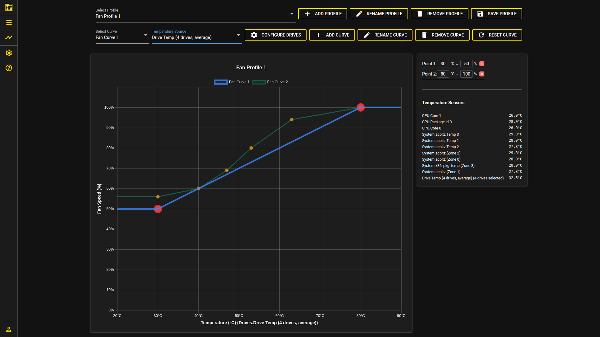

# Hako Foundry

A server chassis storage companion app that organizes and displays hard drive SMART data with powering monitoring and fan curves for your Hako-Core.

## Overview

Hako Foundry is a containerized application that combines drive health monitoring through SMART data analysis with hardware control capabilities via the Hako-Core Powerboard. If no powerboard is connected, you will still have access to drive organization and SMART data monitoring. Primary development and testing is performed on TrueNAS Scale, though the application should work on other Docker-capable systems.




## Features

- **Drive Organization & Monitoring**: Centralized view of all connected hard drives with SMART data visualization
- **Fan Control**: Control individual fan walls through the Hako Core Powerboard interface
- **Custom Fan Curves**: Automatic fan speed adjustment based on assignable temperature sensors
  - **Hardware Temperature Sensors**: Use Linux hardware sensors to monitor CPU, motherboard, and other system temperatures
  - **Hard Drive Temperature Monitoring**: Assign fan curves to monitor specific hard drive temperatures
  - **Drive Selection**: Choose from any detected drive in your system to use as a temperature source for fan curve control
  - **Flexible Configuration**: Mix and match Linux hardware sensors with drive temperatures for optimal cooling strategies

## Status

**Beta Version** - This project is currently in beta. Please report any bugs you encounter or drives that are not properly supported.

## Quick Start

Once your TrueNAS has configured a pool for apps, head to the shell and choose one of the following commands based on whether you want authentication. **REPLACE `your-secret` WITH YOUR OWN SECRET**

**With Authentication:**
Credential input will be done on first visit.
```bash
sudo docker run -d \
  --pull always \
  $(ls /dev/ttyACM* | sed 's/^/--device /') \
  $(lsblk -d -n -o NAME | grep '^sd' | sed 's|^|--device /dev/|') \
  --cap-add SYS_RAWIO \
  -v foundry_config:/app/config/ \
  -v /sys/class/thermal:/sys/class/thermal:ro \
  -v /sys/class/hwmon:/sys/class/hwmon:ro \
  -e SECRET='your-secret' \
  -p 8080:8080 \
  hakoforge/hako-foundry
```

**Without Authentication (Open Access):**
```bash
sudo docker run -d \
  --pull always \
  $(ls /dev/ttyACM* | sed 's/^/--device /') \
  $(lsblk -d -n -o NAME | grep '^sd' | sed 's|^|--device /dev/|') \
  --cap-add SYS_RAWIO \
  -v foundry_config:/app/config/ \
  -v /sys/class/thermal:/sys/class/thermal:ro \
  -v /sys/class/hwmon:/sys/class/hwmon:ro \
  -e OPEN_ACCESS='true' \
  -e SECRET='your-secret' \
  -p 8080:8080 \
  hakoforge/hako-foundry
```


## Docker Compose

Alternatively, you can use the included interactive `setup.sh` script to generate a `docker-compose.yml` with automatic device discovery and sensible defaults. To copy the script to a remote machine and run it locally, use one of the following safe options (review the script before running):

```bash
# Download, make executable, then run
curl -fsSL https://raw.githubusercontent.com/HakoForge/HakoFoundry/setup.sh -o setup.sh
chmod +x setup.sh
./setup.sh
```

Or with wget:

```bash
wget -qO setup.sh https://raw.githubusercontent.com/HakoForge/HakoFoundry/setup.sh
chmod +x setup.sh
./setup.sh
```

Once the server is running, head over to the port that was configured and organize your drives.
Add backplanes, select drives. Click on the drive banner on the top right to remove a drive. Right click on backplanes to remove them. Click on the fans to control them. Unchecking the *manual* checkbox will allow you to select a fan profile.

Fan profiles are made on the *fan curve* page. There can be multiple fan profiles which can be assignd to different fan walls. Each fan profile can also have multiple fan curves. This is how you would implement multi sensor fan control. Selecting *Drives* as a temperature source will allow you to select a set of drives to use as a temperature source.

## Command Breakdown

- **Powerboard Detection**: `$(ls /dev/ttyACM* | sed 's/^/--device /')` - Automatically detects and passes powerboard USB connections
  ```bash
  # Example output: --device /dev/ttyACM0 --device /dev/ttyACM1
  ```
- **Drive Detection**: `$(lsblk -d -n -o NAME | grep '^sd' | sed 's|^|--device /dev/|')` - Identifies and passes all connected drives
  ```bash
  # Example output: --device /dev/sda --device /dev/sdb --device /dev/sdc --device /dev/sdd
  ```
- **Raw I/O Access**: `--cap-add SYS_RAWIO` - Required for SMART data collection
- **Persistent Storage**: `-v foundry_config:/app/config/` - Creates a Docker volume to preserve configuration between restarts
- **Hardware Temp Sensors**: `-v /sys/class/thermal:/sys/class/thermal:ro -v /sys/class/hwmon:/sys/class/hwmon:ro`  - Gives acces to the hardware sensor directory for fan curves
- **Port Mapping**: `-p 8080:8080` - Maps host port to container port (host:container)
- **Running in the Background**: `-d` - Runs the container in detached mode so it doesn't stop when the shell stops. Alternatively, you can use `tmux` or `screen`

## Roadmap

### Planned Features

- **Long-term Data Logging**: Historical tracking of drive attributes and power usage
- **Advanced Analytics**: Trend analysis and predictive maintenance alerts
- **Enhanced Graphs**: Visual representation of performance metrics over time
- **Powerboard Updates**: Built in firmware updates

## Setup Script

This repository includes an interactive setup helper script, `setup.sh`, which generates a ready-to-run `docker-compose.yml` with dynamic device discovery (block devices and serial ports), an auto-generated secret, and simple options for storage, port, and access mode.

Quick usage:

```bash
./setup.sh
# Review the generated docker-compose.yml, then:
docker compose up -d
```

What the script does (short):
- Generates a URL-safe secret and prints it for your records
- Lets you choose between a Docker volume or a bind mount for config
- Optionally auto-scans for `/dev/sd*` block devices and `/dev/ttyACM*`/`/dev/ttyUSB*` serial ports and inserts them into `docker-compose.yml`
- Sets the host port and whether the app runs in open-access mode

See `setup.sh` for all prompts and options. Re-run the script to regenerate the compose file with different settings.

## Support & Contributing

### Bug Reports

Since this is a beta release, your feedback is valuable! Please report:
- Any bugs or unexpected behavior
- Drives that are not properly detected or supported
- Feature requests or suggestions
